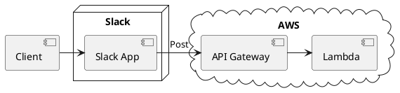

# Event Reminder Slack slash command

The project is deployment scripts of an event reminding bot of Slack.
The bot is implemented with AWS API Gateway and Lambda.

## Structure



## Prerequisite

* AWS CLI
* AWS SAM CLI
* Docker
* nodejs/npm

## Deploy AWS components

```bash
sam build
sam deploy --guided
```

## Clean up

```bash
aws cloudformation delete-stack --stack-name event-reminder
```

## Contribution

Unit test an application.

```bash
cd event-reminder
npm install
npm run test
```

Build an application.

```bash
sam build
```

Run functions locally and invoke them.

```bash
sam local invoke HelloWorldFunction --event events/event.json
```
