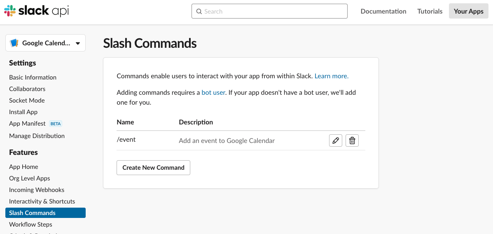
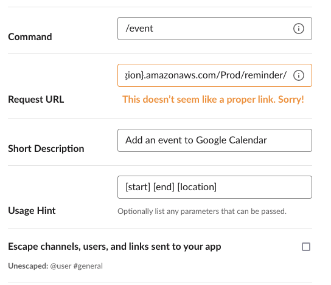

# Event Reminder Slack slash command

The project is deployment scripts of an event reminding bot of Slack.
The bot is implemented with AWS API Gateway and Lambda.

## Structure


[PlantUML code](http://www.plantuml.com/plantuml/uml/SoWkIImgAStDuShBJqbLK0hEIKpELbAevb9GY0Qp5HmB2cAvQhcuadFoIrCKb1p3Ww7IZW6U2kw99QdbYPMn8BvFOcvIIY9ORRHpJcPgNaciWcwHhXsAGGWsH1BL60KhXO3yuX8kP468EeJn3gbvAK3t0W00)

## Prerequisite

* AWS CLI
* AWS SAM CLI
* Docker
* nodejs/npm

## Set up

### Deploy AWS components

```bash
sam build
sam deploy --guided
```

Followings are outputs.
Copy a value of API URL that is used in setting up a Slack app.

```txt
Key                 EventReminderApi
Description         API Gateway endpoint URL for Prod stage for Event Reminder function
Value               https://{api_id}.execute-api.ap-northeast-1.amazonaws.com/Prod/reminder/

Key                 EventReminderFunction
Description         Event Reminder Lambda Function ARN
Value               arn:aws:lambda:{regin}:{account_id}:function:event-reminder-EventReminderFunction-{func_id}

Key                 EventReminderFunctionIamRole
Description         Implicit IAM Role created for Event Reminder function
Value               arn:aws:iam::{account_id}:role/event-reminder-EventReminderFunctionRole-{role_id}
```

### Create Slack app

Create a new slach command from Slack API management page.



Configure of the new slash command like following.
Paste the URL in "Request URL".



### Clean up AWS components

```bash
aws cloudformation delete-stack --stack-name event-reminder
```

## Contribution

Unit test an application.

```bash
cd event-reminder
npm install
npm run test
```

Build an application.

```bash
sam build
```

Run functions locally and invoke them.

```bash
sam local invoke EventReminderFunction --event events/event.json
```
